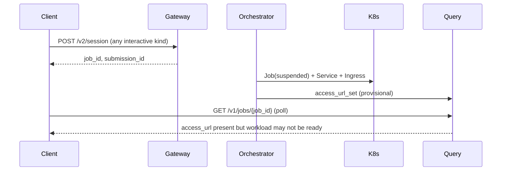
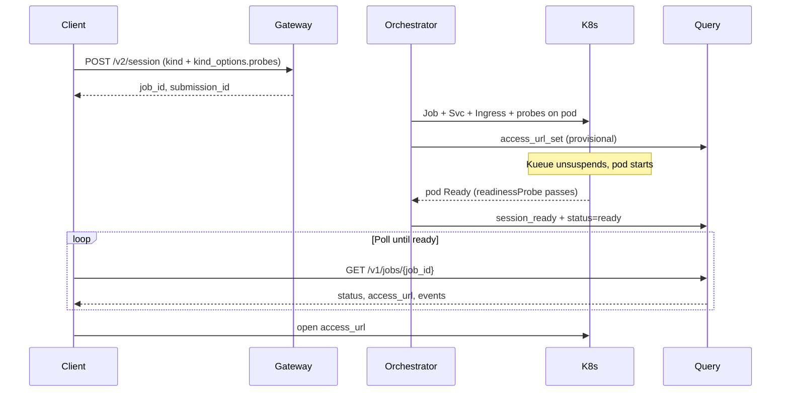

# Interactive Session Readiness Plan

*(Filename retained: `notebook-url-broadcast.plan.md`)*

## Scope

**In scope:** Server-side infrastructure and API contract so a **future client** can submit any interactive session kind, poll Query until `status == "ready"`, and open `access_url`.

**Not in scope:** Browser GUI, CLI poller, catalog → OCI resolution, webhooks/SSE (Phase 2), ingress edge auth.

**Kinds covered:**

| Kind | `session_ready` | Notes |
|------|-----------------|-------|
| `desktop` | Yes | NoVNC; default port 6080 |
| `notebook` | Yes | Jupyter; default port 8888 |
| `carta` | Yes | Default port 9090 |
| `contributed` | Yes | User image; **must supply probes** in envelope |
| `headless` | **No** | Batch; no Ingress/`access_url`; job watch only |

---

## Current state

The platform creates K8s Job + Service + Ingress for interactive workloads, but **does not yet deliver a usable URL at the right time**.



**What works today**

| Step | Location | Behavior |
|------|----------|----------|
| Interactive defaults | [`validation.py`](services/gateway/src/hammrly_gateway/validation.py), [`networking.py`](services/orchestrator/src/hammrly_orchestrator/networking.py) | `needs_service=true`, `needs_ingress=true` for desktop/notebook/carta/contributed |
| Per-kind service port helper | [`pod_spec.py`](services/orchestrator/src/hammrly_orchestrator/k8s/pod_spec.py) `workload_container_port()` | desktop 6080, notebook 8888, carta 9090, contributed 8080 |
| K8s create | [`submitter.py`](services/orchestrator/src/hammrly_orchestrator/k8s/submitter.py) | Suspended Job + Service (80→workload port) + Ingress |
| URL compute + persist | [`edge_binding.py`](services/orchestrator/src/hammrly_orchestrator/k8s/edge_binding.py), [`cli.py`](services/orchestrator/src/hammrly_orchestrator/cli.py) | `https://{host}{path}/` stored in `submissions.access_url` |
| Job detail | [`app.py`](services/query/src/hammrly_query/app.py) | `GET /v1/jobs/{job_id}` returns `access_url` + `events[]` |

**Gaps**

1. **URL published before workload listens** — `access_url` written at Ingress create while Job is still suspended.
2. **No container ports or probes** — [`pod_spec.py`](services/orchestrator/src/hammrly_orchestrator/k8s/pod_spec.py) never declares ports or K8s probes on the workload container.
3. **Ingress path not wired into runtimes** — notebook `base_url`, desktop `path_prefix`, etc. not injected.
4. **No probe contract** — submitters cannot specify how each kind's liveness/readiness/startup checks work.
5. **No "ready to open" signal** — job watch maps Job → `running`; no `ready` / `session_ready`.
6. **Awkward client polling** — interactive list omits `access_url`; docs lack poll-until-ready contract.

---

## Recommended delivery model

**Phase 1 (implement now):** Query API polling with explicit readiness semantics.

- Authoritative URL stays in Postgres (orchestrator-owned).
- **`session_ready`** fires only after the pod's **readinessProbe succeeds** (K8s pod condition `Ready=True`).
- Clients poll `GET /v1/jobs/{job_id}` until **`status == "ready"`**, then open `access_url`.
- Provisional URL via existing `access_url_set` event (and optional gateway `HAMMRLY_RETURN_TENTATIVE_ACCESS_URL`).

**Phase 2 (follow-on):** SSE on Query — transport only; same readiness gate.

---

## Target end-to-end flow



---

## Implementation plan

### 1. Contract — per-kind probes in the submission envelope

**Files:** [`contracts/job-submission/v1/schema.json`](contracts/job-submission/v1/schema.json), [`VALIDATION.md`](contracts/job-submission/v1/VALIDATION.md)

Add shared probe types aligned with Kubernetes probe semantics (subset):

```json
"WorkloadProbes": {
  "type": "object",
  "properties": {
    "readiness": { "$ref": "#/$defs/ContainerProbe" },
    "liveness":  { "$ref": "#/$defs/ContainerProbe" },
    "startup":   { "$ref": "#/$defs/ContainerProbe" }
  },
  "additionalProperties": false
}
```

`ContainerProbe` supports `httpGet`, `tcpSocket`, or `exec`, plus standard timing fields (`initialDelaySeconds`, `periodSeconds`, `timeoutSeconds`, `failureThreshold`, `successThreshold`).

Add **`probes`** to each interactive kind's `kind_options` block (alongside existing `novnc`, `jupyter`, `carta`, `contributed` keys):

```json
"kind_options": {
  "jupyter": { "port": 8888 },
  "probes": {
    "readiness": {
      "httpGet": { "path": "{ingress_path}api", "port": "workload" },
      "initialDelaySeconds": 5
    }
  }
}
```

**Path/port placeholders** (resolved by orchestrator at pod build time):

| Placeholder | Resolves to |
|-------------|-------------|
| `{ingress_path}` | Path from [`ingress_path_for_workload()`](services/orchestrator/src/hammrly_orchestrator/k8s/edge_binding.py), normalized for probe use |
| `{workload_port}` / `"workload"` | [`workload_container_port()`](services/orchestrator/src/hammrly_orchestrator/k8s/pod_spec.py) |

**Validation rules** ([`VALIDATION.md`](contracts/job-submission/v1/VALIDATION.md)):

| Kind | `kind_options.probes` |
|------|------------------------|
| `desktop`, `notebook`, `carta` | Optional — orchestrator applies **documented platform defaults** when omitted (enables curl/manual testing before a client exists) |
| `contributed` | **`readiness` required** when `needs_ingress=true` — no safe default for arbitrary images |
| `headless` | Ignored — no session readiness flow |

Gateway validates probe shape (JSON Schema + semantic checks); orchestrator is authoritative for rendering to `V1Probe`.

**Example defaults** (orchestrator-built-in when envelope omits probes):

| Kind | Default readiness | Kind-specific env (still applied) |
|------|-------------------|-----------------------------------|
| `notebook` | `httpGet` `{ingress_path}api` on workload port | `ServerApp.base_url={ingress_path}`, optional `JUPYTER_TOKEN` from `token_ref` |
| `desktop` | `httpGet` `/` on novnc port | `path_prefix` / NoVNC subpath env if applicable |
| `carta` | `httpGet` `/` on carta port | TBD per CARTA image contract |
| `contributed` | *(none — submitter must specify)* | — |

### 2. Orchestrator — kind runtime wiring + probe rendering

**Files:** new [`k8s/probes.py`](services/orchestrator/src/hammrly_orchestrator/k8s/probes.py), [`pod_spec.py`](services/orchestrator/src/hammrly_orchestrator/k8s/pod_spec.py), [`submitter.py`](services/orchestrator/src/hammrly_orchestrator/k8s/submitter.py)

- Pass **`submission_id`**, **ingress path**, and **`settings`** into `build_pod_template()`.
- For workloads with `needs_service=true`:
  - Declare **`containerPort`** on the workload container (from `workload_container_port()`).
  - Resolve probes: envelope `kind_options.probes` → platform default → render to `V1Probe` objects.
  - Attach **`readiness_probe`**, optional **`liveness_probe`**, optional **`startup_probe`** on the workload container.
- **Kind-specific env/args injectors** (separate from probe config, still kind-aware):
  - `notebook`: `ServerApp.base_url`, token secret ref
  - `desktop`: NoVNC path alignment with ingress
  - `carta` / `contributed`: minimal wiring; contributed relies on submitter probes + optional command/args

**Why readiness probe on the pod matters:** orchestrator pod watch keys off K8s pod condition `Ready=True`, which reflects readinessProbe success — no custom in-cluster HTTP polling.

### 3. Readiness gate in orchestrator persistence

**Files:** [`persistence/repository.py`](services/orchestrator/src/hammrly_orchestrator/persistence/repository.py), [`persistence/models.py`](services/orchestrator/src/hammrly_orchestrator/persistence/models.py), new Alembic migration

- Add submission status **`ready`** (distinct from `running`).
- Add `mark_session_ready(submission_id)`:
  - Only for submissions where stored workload had **`needs_ingress=true`**
  - Sets `status = "ready"` (from `running` / `admitted` only)
  - Emits `session_ready` event with `{ "access_url": "<existing url>" }`
  - Idempotent if already `ready`
- Keep `update_submission_access_url()` at Ingress create for provisional URL + `access_url_set`.

**Pod watch:** new [`pod_watch.py`](services/orchestrator/src/hammrly_orchestrator/k8s/pod_watch.py)

- Watch pods labeled `hammrly.io/submission-id` (parallel to [`job_watch.py`](services/orchestrator/src/hammrly_orchestrator/k8s/job_watch.py)).
- On pod condition **`Ready=True`**, look up submission; if `needs_ingress` → `mark_session_ready()`.
- Start from [`cli.py`](services/orchestrator/src/hammrly_orchestrator/cli.py) (config flag, e.g. `HAMMRLY_POD_WATCH_ENABLED`).

### 4. Query API — polling as broadcast channel

**Files:** [`services/query/src/hammrly_query/app.py`](services/query/src/hammrly_query/app.py), [`SPEC.md`](services/query/SPEC.md), [`README.md`](README.md)

- Add `access_url` to **`InteractiveJobItem`** on `GET /v1/me/jobs/interactive`.
- Document client contract (all interactive kinds):
  - Poll `GET /v1/jobs/{job_id}` (exponential backoff, 1s → 5s cap).
  - **`status == "ready"`** → open `access_url`.
  - Progress: `received` → `submitted_to_cluster` → `admitted` → `running` → `ready`.
  - Events: `access_url_set` (provisional) vs `session_ready` (openable).
- Update README examples for notebook **and** note the shared contract applies to desktop/carta/contributed.

### 5. Gateway (optional UX polish)

**Files:** [`envelope.py`](services/gateway/src/hammrly_gateway/envelope.py), gateway SPEC, [`helm/gateway/values.yaml`](helm/gateway/values.yaml)

- Validate `kind_options.probes` per rules above.
- Enable `returnTentativeAccessUrl: true` in stack values for dev/demo.
- Document: 201 `access_url` is provisional; wait for Query `status=ready`.
- Readiness logic stays in orchestrator (gateway remains stateless).

### 6. Helm / config alignment

**Files:** [`helm/orchestrator/values.yaml`](helm/orchestrator/values.yaml), [`helm/orchestrator/templates/deployment.yaml`](helm/orchestrator/templates/deployment.yaml), [`helm/stack/values.yaml`](helm/stack/values.yaml)

- Fix **`session.kinds` vs flat `session.<kind>`** mismatch so per-kind ingress path env vars render.
- Align `HAMMRLY_K8S_INGRESS_HOST`, `HAMMRLY_PUBLIC_URL_SCHEME`, path templates between gateway and orchestrator.
- Add **multi-kind stack examples** (notebook + desktop queues/path templates).
- Confirm `k8sSubmitEnabled: true` for cluster environments.
- Probes live in the **contract**, not Helm — Helm only needs ingress/host alignment.

### 7. Tests

| Area | Files |
|------|-------|
| Schema + gateway validation for probes | `services/gateway/tests/`, contract fixtures |
| Probe placeholder resolution + V1Probe rendering | `services/orchestrator/tests/test_probes.py` |
| Per-kind pod spec (ports, env, probes) | `services/orchestrator/tests/test_pod_spec_*.py` |
| Platform default probes when omitted | orchestrator tests per kind |
| `contributed` rejects missing readiness probe | gateway validation test |
| `mark_session_ready` idempotency + needs_ingress guard | repository tests |
| Pod watch → ready transition | unit test with mocked pod Ready |
| Query interactive list `access_url` | [`services/query/tests/test_routes.py`](services/query/tests/test_routes.py) |
| Contract docs | README + query SPEC + VALIDATION.md |

---

## Out of scope

- Client implementation (Browser GUI, poller UI)
- Catalog → OCI resolution
- Webhooks / SSE (Phase 2)
- **`headless`** session_ready / access_url flow
- Ingress auth at the edge (OAuth2 proxy, etc.)
- Helm-defined probe overrides (probes are contract-defined; platform defaults are orchestrator code)

---

## Client integration sketch (future)

1. Search catalog → filter by supported mode (NOTEBOOK, DESKTOP, etc.).
2. Resolve OCI image (client-side for now).
3. Build envelope with **`kind_options.probes`** (required for `contributed`; optional for known kinds).
4. `POST /v2/session` → store `job_id`.
5. Poll Query until `status == "ready"`.
6. Navigate to `access_url`.

Until a client exists, validate manually with curl examples in README (include probe blocks in sample payloads).

---

## Risks and mitigations

| Risk | Mitigation |
|------|------------|
| Image ignores ingress subpath config | Document per-kind runtime requirements; integration tests against reference images |
| Probe path vs ingress trailing slash | Single path helper (`ingress_path_for_workload`) for ingress, env injection, and probe paths |
| `contributed` images with unknown health endpoints | Require explicit `readiness` probe in contract; gateway rejects otherwise |
| Kueue delay before pod start | Status progression + poll-until-ready |
| Provisional vs ready URL confusion | Separate `access_url_set` / `session_ready` events; document gateway tentative URL |
| Over-broad probe schema | Start with httpGet/tcpSocket/exec subset matching K8s; extend only as needed |
